<p align="center">
  
</p>

<p align="center">
  <a href="https://www.npmjs.com/package/compactio"></a>
  <a href="https://github.com/RamaAditya49/compactio/actions/workflows/ci.yml"></a>
  <a href="LICENSE"></a>
  
  <a href="https://docs.typesafe.ai"></a>
</p>

<p align="center">
  <a href="#quick-start">Quick start</a> ·
  <a href="#how-it-works">How it works</a> ·
  <a href="#configuration">Configuration</a> ·
  <a href="#faq">FAQ</a> ·
  <a href="BLUEPRINT.md">Blueprint</a>
</p>

---

Your coding agent uses its most expensive model for every small decision. It sends every test log, build log, and search result to that model. Then it carries the output into every later turn, and you pay for it again each time.

**compactio adds a System 1.** After each tool call, a fast decision model ([Jev](https://docs.typesafe.ai)) answers one question: *how much of this output does the agent need for the current goal?* Jev does not write text. It returns a typed choice in about half a second, and code applies that choice. The LLM reads only what it needs.

<p align="center">
  
</p>

<p align="center"><sub>A real Claude Code run: <b>20,501 → 747 characters (−96%)</b> in 0.75 s for $0.00005. The agent still found the cause.</sub></p>

## Why

In *Thinking, Fast and Slow*, Daniel Kahneman describes two systems. **System 1** is fast and automatic. **System 2** is slow and deliberate. Coding agents have only System 2.

| | |
|---|---|
| **~50%** | Share of a Claude Code context that is tool output ([ctxlens profile](https://dev.to/royalpinto007/profiling-an-ai-agents-context-window-where-the-tokens-actually-go-422o)) |
| **97%** | Share of billed tokens that are cache reads: old context, paid again on each turn ([devxlabs](https://devxlabs.ai/blogs/how-claude-code-actually-works)) |
| **Late** | Compaction starts only near the limit, costs one more large request, and can lose instructions |

compactio stops the waste where it starts: at the tool output, before it enters the context.

## Features

- **Decides, does not generate.** Jev picks one of four views: `full`, `errors`, `headtail`, `stub`.
- **Safe by default.** Low confidence, a timeout, or an API error returns the full output. compactio never blocks your agent.
- **Nothing is lost.** Every cut output stays on your disk. The note in the output tells the agent how to get it back.
- **Code is never cut.** A `Read` of a source file always passes in full. compactio only skips an exact re-read of an unchanged file.
- **Data files are cut.** A `Read` of a log, a CSV, a JSONL dump, a lockfile, or a minified bundle takes the same path as `Bash` output.
- **Old output can go too (opt-in).** The Sweep proxy removes old tool results that the current goal no longer needs. See [Sweep](#sweep-opt-in).
- **Secrets stay local.** API keys, tokens, private keys, and `KEY=value` pairs are masked before any request.
- **Two providers.** Use a TypeSafe key or an OpenRouter key.
- **Works without a key.** Local mode uses lossless filters, the re-read skip, and a head-and-tail cut for very large output.
- **Zero dependencies.** No build step for the plugin, and no `node_modules`.

## Quick start

**1. Install the plugin in Claude Code**

```bash
claude plugin marketplace add RamaAditya49/compactio
claude plugin install compactio@compactio
```

Node 22.18 or later must be on your `PATH`.

**2. Add one API key** in `~/.claude/settings.json`. Pick one provider:

```jsonc
{
  "env": {
    // Option A: TypeSafe, the maker of Jev (https://console.typesafe.ai/keys)
    "TYPESAFE_API_KEY": "your-typesafe-key"

    // Option B: OpenRouter (https://openrouter.ai/keys)
    // "OPENROUTER_API_KEY": "sk-or-..."
  }
}
```

Without a key, compactio runs in local mode.

**3. Restart Claude Code.** compactio now works on every session.

**4. See the savings**

```text
/compactio:gain
```

```text
compactio · all sessions
────────────────────────────────────────────────────
  Tokens kept out of context   ~12,478
  Share of tool output cut     ████░░░░░░░░░░░░░░░░ 20%
  Outputs cut                  3 of 17  (avg cut 93%)
  Jev decisions                4  ·  $0.0002
  Unchanged re-reads skipped   0
  Fail-open                    0
────────────────────────────────────────────────────
  Biggest cuts
    Bash   headtail   30.0k → 408    chars  (local)
    Bash   errors     20.5k → 747    chars  (jev)
    Bash   clean       3.0k → 2.4k   chars  (lossless)
────────────────────────────────────────────────────
  tokens ≈ characters ÷ 4
```

You can also run the scoreboard outside Claude Code: `npx compactio gain`.

## How it works

<p align="center">
  
</p>

compactio uses the Claude Code `PostToolUse` hook. The hook runs after a tool finishes and before the model sees the result.

| Step | Who | What |
|---|---|---|
| 1 | Tool | Output arrives from `Bash`, `Grep`, `WebFetch`, `WebSearch`, an MCP tool, or `Read`. |
| 2 | Code | Output below 2,000 characters passes. An exact re-read of an unchanged file becomes one line. |
| 3 | Code | Remove ANSI codes, repeated lines, and blank runs. No information is lost. |
| 4 | Jev | For output above 6,000 characters, choose the view that the current goal needs. |
| 5 | Code | Apply the view, store the original on disk, and add a one-line note. |
| 6 | LLM | Read the result. |

| View | The agent keeps | Typical case |
|---|---|---|
| `full` | All of the output | The output is the answer, or the agent will edit from it |
| `errors` | Error, failure, and warning lines with context, plus the tail | A test run with one failure |
| `headtail` | The first 40 and the last 30 lines | A long build or install log |
| `stub` | One line | Output that is not related to the goal |

### Sweep (opt-in)

The hook can only cut **new** output. Old tool results stay in the history, and the agent sends them again on every turn. The Sweep removes them.

The Sweep is a local proxy between Claude Code and the Anthropic API. On each request it does three steps:

| Step | Who | What |
|---|---|---|
| 1 | Code | Put back every earlier tombstone, so that the prompt prefix does not change between turns. |
| 2 | Jev | When old results hold 40,000 characters or more, rate up to 16 of them in one request: `keep` or `drop`. |
| 3 | Code | Replace the `drop` results with a tombstone, but only when the saving pays for the prompt-cache rewrite. |

A tombstone looks like this:

```text
[compactio: the output of Bash npm test was removed because the current goal no longer needs it. Full output: node ".../cli.js" show 1a2b3c4d. Or run the tool again.]
```

Rules:

- The last 10 messages are never swept. They are the work in progress.
- Results below 4,000 characters and results with images are never swept.
- Jev must answer `drop` with a confidence of 0.8 or more. Otherwise the result stays.
- **Cache gate.** A change in the middle of the history makes the next request write the cache again after that point. The Sweep drops only when `dropped × 0.1 × turns ≥ rest-of-history × 1.15`. `turns` is `COMPACTIO_SWEEP_TURNS` (default 30).

**Start the proxy** in its own terminal, and keep it running:

```bash
npx compactio proxy 8787
```

**Point Claude Code at it** in `~/.claude/settings.json`:

```jsonc
{
  "model": "claude-opus-5-5[1m]",
  "env": {
    "ANTHROPIC_BASE_URL": "http://127.0.0.1:8787"
  }
}
```

Keep the `[1m]` suffix on the model name. With a custom `ANTHROPIC_BASE_URL`, Claude Code 2.1.282 did not use the 1M context window. It compacted again and again ("Autocompact is thrashing"), also through a plain proxy without compactio. The suffix fixed it.

To stop the Sweep, remove `ANTHROPIC_BASE_URL` first, then stop the proxy.

### What leaves your machine

Only a bounded and redacted summary goes to the provider:

- the goal: your last prompt, up to 2,000 characters
- the tool name and its input, up to 600 characters
- a preview of the output: the first lines, the error lines, and the last lines, about 6,000 characters in total

The full output never leaves your machine. Without an API key, nothing leaves your machine.

## Configuration

Set these variables in the `env` block of `~/.claude/settings.json`.

| Variable | Default | Description |
|---|---|---|
| `TYPESAFE_API_KEY` | — | Use Jev through TypeSafe. It has priority when both keys are set. |
| `OPENROUTER_API_KEY` | — | Use Jev through OpenRouter. Requests show as the app **compactio** on OpenRouter. |
| `COMPACTIO_JEV_MODEL` | `jev-1.13.0` (TypeSafe), `~typesafe/jev-latest` (OpenRouter) | Jev model. |
| `COMPACTIO_JEV_URL` | the provider endpoint | Custom endpoint, for example a proxy. |
| `COMPACTIO_TIMEOUT_MS` | `1500` | Time limit for one decision. After it, the full output passes. |
| `COMPACTIO_HOME` | `~/.compactio` | Folder for stored outputs, read hashes, Sweep decisions, and the decision log. |
| `COMPACTIO_UPSTREAM` | `https://api.anthropic.com` | Sweep proxy: the API that receives the requests. |
| `COMPACTIO_PORT` | `8787` | Sweep proxy: the local port, when `proxy` gets no port. |
| `COMPACTIO_SWEEP_TIMEOUT_MS` | `3000` | Sweep proxy: time limit for one Jev request. After it, the history passes unchanged. |
| `COMPACTIO_SWEEP_TURNS` | `30` | Sweep proxy: expected turns left in a session. A higher value drops more often. |

## Commands

| Command | Description |
|---|---|
| `/compactio:gain` | Show the savings scoreboard in Claude Code. |
| `npx compactio gain` | Show the scoreboard in a terminal. |
| `npx compactio show <id>` | Print a stored original output. The agent runs this itself when it needs the full output. |
| `npx compactio proxy [port]` | Run the Sweep proxy on `127.0.0.1`. |
| `claude plugin disable compactio@compactio` | Turn compactio off. |

## FAQ

<details>
<summary><b>Can compactio break my agent?</b></summary>

compactio fails open. If Jev is slow, returns an error, or has low confidence, the agent gets the full output. Source files from `Read` are never cut. Every cut output is stored, and the note in the output tells the agent how to get it back.
</details>

<details>
<summary><b>Does it send my code to a third party?</b></summary>

Only when you set an API key, and only a redacted preview of large tool outputs (see <a href="#what-leaves-your-machine">What leaves your machine</a>). The redaction uses patterns, so it cannot find every possible secret. If that is a concern for a project, run compactio without a key.
</details>

<details>
<summary><b>How much does it cost?</b></summary>

One Jev decision uses about 1,000 input tokens. At $0.042 per million input tokens, that is about $0.00005. Output tokens are free. Most tool outputs are small and need no decision at all.
</details>

<details>
<summary><b>Does it replace compaction?</b></summary>

No. It makes compaction less frequent, because less output enters the context. Claude Code still compacts when the window is full.
</details>

<details>
<summary><b>Does it work with rtk?</b></summary>

Yes. rtk shrinks known shell commands before they run. compactio acts after each tool call and also covers Grep, web tools, MCP tools, and re-reads.
</details>

<details>
<summary><b>Which agents are supported?</b></summary>

Claude Code today. Codex CLI, OpenCode, Gemini CLI, Cursor, and Trae are next. See the <a href="#roadmap">roadmap</a>.
</details>

## Honest numbers

- Token counts are estimates: characters ÷ 4.
- "Hundreds of times cheaper" applies to one decision (Jev compared with an LLM), not to your total bill.
- Claude Code already limits Bash output to 30,000 characters. On one Bash call, compactio saves at most about 7,500 tokens. The agent then carries that saving through every later turn.
- We make no claim about the total bill until the public benchmark (task success, tokens, and cost) exists.

## Limitations

Read these before you use compactio. They are the limits of the design, not bugs.

**Where compactio has no effect**

- **Your messages, the agent's replies, the system prompt, and MCP tool schemas.** compactio only touches tool output.
- **Source code from `Read`.** It always passes in full, because the agent may edit it. In a session that mostly reads code, the saving is small.
- **Images, PDFs, and notebooks from `Read`.** They pass untouched and do not count in the scoreboard.
- **Old context, without the Sweep.** The hook only cuts new output. The history that is already in the context stays until you run the Sweep, `/compact`, or `/clear`.
- **Other hosts.** v0.1 works in Claude Code only.

**Limits of the decision**

- **Jev sees a preview, not the full output.** The preview is the head, the error lines, and the tail, about 6,000 characters (2,400 for each Sweep result). Jev can misjudge an output whose important part is in the middle.
- **Jev request limits.** State and questions must fit in 64,000 tokens, and state plus the longest question in 32,000 tokens. For this reason, one Sweep request rates 16 results at most. The others wait for a later request.
- **The goal is the last prompt.** A short prompt such as "continue" gives Jev little to work with.
- **The data-file list is fixed.** compactio knows a data file by its name: `.log`, `.out`, `.csv`, `.tsv`, `.jsonl`, `.ndjson`, `.map`, `.min.js`, `.min.css`, and common lockfiles. If the agent must edit such a file, it gets a cut view. It must run `compactio show <id>` to see all of it.
- **Latency.** A large output waits up to 1.5 s for Jev. A Sweep request waits up to 3 s. The time limit then lets the output pass unchanged.

**Limits of the Sweep proxy**

- **Claude Code cannot reach the API when the proxy is down.** The proxy fails open for its own errors, but not for a stopped process. Remove `ANTHROPIC_BASE_URL` before you stop it.
- **Each sweep costs one cache rewrite.** The cache gate estimates the cost with a fixed number of turns left (`COMPACTIO_SWEEP_TURNS`). If the session ends sooner, the sweep costs more than it saves.
- **A tombstone is permanent.** A dropped result stays dropped for the whole session. The agent must run the tool again or run `compactio show <id>`.
- **The proxy sees all API traffic,** including the auth header. It forwards the header and does not store it. It stores the dropped outputs on disk under `COMPACTIO_HOME`.
- **Set the context window yourself.** Behind a custom `ANTHROPIC_BASE_URL`, Claude Code does not detect the 1M window. Use a model name with `[1m]`, or autocompact runs in a loop.
- **Test coverage.** Unit tests use a fake API and a fake Jev. One real Claude Code session (Opus 5.5, subscription login) ran through the proxy with 3 reads and 8 shell calls. Jev rated the old reads in 0.7 s. Longer real sessions are not tested yet.

**Limits of the numbers**

- Token counts are estimates: characters ÷ 4.
- The state files (`store/`, `sessions/`, `sweep.json`) are never pruned.

## How compactio compares

| | compactio | [rtk](https://github.com/rtk-ai/rtk) | [fast-jev-compaction](https://github.com/tamaratran/fast-jev-compaction) |
|---|---|---|---|
| When it acts | After each tool call | Before each shell command | At compaction |
| How it decides | Jev, from the current goal and a content preview | Fixed rules per command | Jev, from a size note |
| Tools covered | Bash, Grep, Web, MCP, data-file reads, re-reads, old results (Sweep) | Shell commands | All, at compaction |

## Roadmap

- [x] **v0.1** Claude Code: tool output filter, re-read skip, scoreboard, redaction, local mode, TypeSafe and OpenRouter
- [ ] **v0.2** Codex CLI, OpenCode, Gemini CLI, Cursor, Trae. Replay evaluation on real sessions.
- [x] **v0.3** Sweep: remove stale context in long sessions (opt-in local proxy), with prompt-cache protection. Data-file reads.
- [ ] **v0.4** Gate: route each prompt to the cheapest model that can do the task
- [ ] **v1.0** Public benchmark

See [BLUEPRINT.md](BLUEPRINT.md) for the full design.

## Development

```bash
git clone https://github.com/RamaAditya49/compactio.git
cd compactio
node --test test/*.test.ts     # tests
node scripts/assets.mjs        # regenerate the README images
```

Use your local copy in Claude Code:

```bash
claude plugin marketplace add ./
claude plugin install compactio@compactio
```

See [CONTRIBUTING.md](CONTRIBUTING.md) for guidelines. Report security issues as described in [SECURITY.md](SECURITY.md).

## Credits

- [Jev](https://docs.typesafe.ai) by [TypeSafe AI](https://typesafe.ai), the decision model that powers compactio.
- *Thinking, Fast and Slow* by Daniel Kahneman, for the System 1 and System 2 model.
- [rtk](https://github.com/rtk-ai/rtk) and [fast-jev-compaction](https://github.com/tamaratran/fast-jev-compaction), which showed that this problem matters.

compactio is not affiliated with TypeSafe AI, OpenRouter, or Anthropic.

## License

[MIT](LICENSE) © 2026 Rama Aditya
